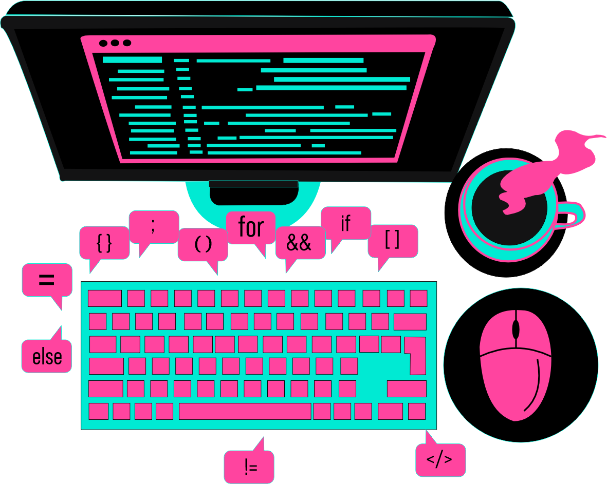

<h1 color=blue> Olá mundo! Sou Aline. </h1>

E aí, explorador digital! Sou uma Designer Gráfico que está desenhando mais do que apenas pixels, estou construindo meu caminho para me tornar uma desenvolvedora Fullstack. Atualmente, estou imersa nos estudos, aprendendo a linguagem das máquinas enquanto continuo a moldar experiências visuais.

 Assim como na arte, na programação eu construo lógica e estilo. Ambas as disciplinas demandam criatividade, precisão e uma paleta de habilidades para criar algo incrível. Design e Desenvolvimento, dois mundos aparentemente distintos, mas unidos pela busca incessante pela estética e funcionalidade.

Estou aberta a colaborações e ansiosa para compartilhar ideias! Se você também está nessa jornada de contribuir com a tecnologia, ou simplesmente quer trocar pensamentos criativos, sinta-se a vontade para entrar em contato.

 
 
 

 

### Tecnologias que possuo conhecimento:  
&nbsp;
&nbsp;
&nbsp;
&nbsp;
&nbsp;
&nbsp;
 
### Ferramentas:
&nbsp;
&nbsp;
&nbsp;
&nbsp;
&nbsp;
&nbsp;
&nbsp;
&nbsp;

### Estudando no momento:
&nbsp;
&nbsp;
&nbsp;
&nbsp;
&nbsp;
&nbsp;
&nbsp;
&nbsp;
&nbsp;
&nbsp;

  Sinta-se a vontade para entrar em contato: ⤵️

 
 

 
 

 
 

  <h3><b>Profile Visitor Count</b></h3>

  

